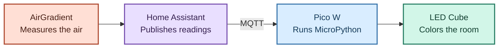

# LED Cube

An ambient air-quality display that turns CO₂ and PM2.5 readings from an AirGradient monitor into a room-readable green-to-red signal.

Built with a Raspberry Pi Pico W, a 50-LED Pimoroni Plasma cube, and MicroPython.

## From the air to the LEDs

The AirGradient monitor is integrated with Home Assistant, which publishes its readings as MQTT messages. The Pico W subscribes to those messages and turns them into colors on the cube.

## Open the hood

### What happens when MQTT is unavailable?

The cube needs MQTT for new readings and on/off commands. Its HTTP maintenance endpoint stays reachable while MQTT reconnects, provided the Pico remains connected to Wi-Fi. Access for fixing the app does not depend on the broker working.

### Updates over Wi-Fi

Enter maintenance mode to pause the app for uploads through WebREPL. Wi-Fi and WebREPL start before the application; maintenance mode stops the LED and MQTT loop and leaves the REPL available. Reboot the Pico after uploading to resume normal operation.

A custom upload client handles the Pico firmware's WebSocket requirements.

